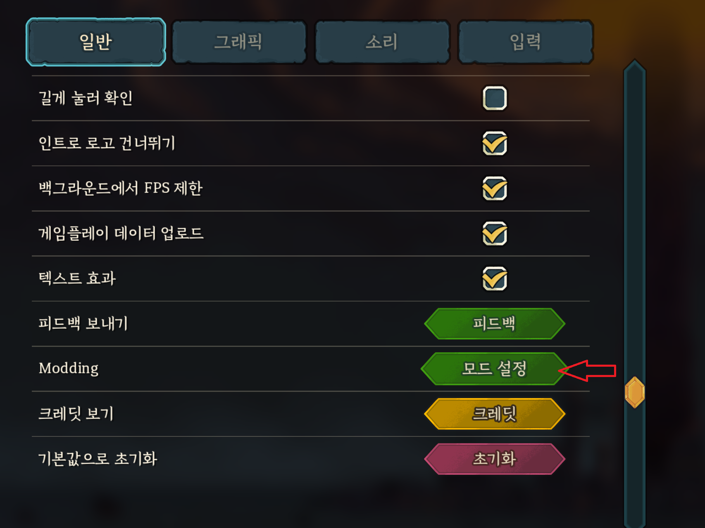
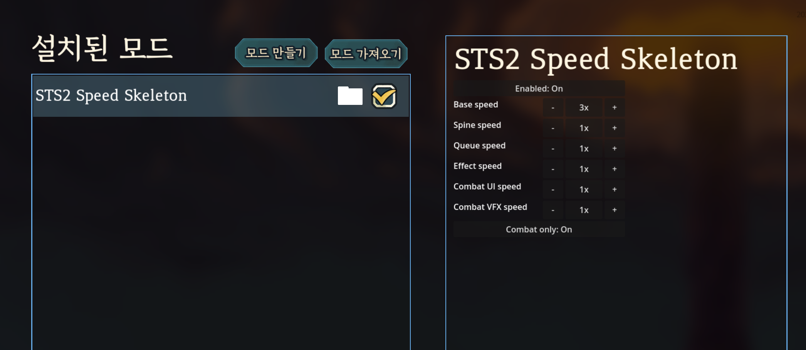

# STS2 Superfast Mod

`Slay the Spire 2` 전투 템포를 빠르게 만드는 속도 모드입니다.

현재 기본 추천값은 `baseSpeed = 3.0` 입니다.

- Spine 애니메이션 가속
- 전투 wait / timer 단축
- 전투 UI delta 갱신 가속
- 전투 VFX delta 갱신 가속

## Demo


## In-game Settings

You can also change the same values directly in-game from `Settings -> Mods -> STS2 Speed Skeleton`.





## 한국어 안내

### 포함 파일

배포 폴더에는 아래 4개 파일이 들어 있습니다.

- `sts2-speed-skeleton.pck`
- `sts2-speed-skeleton.dll`
- `Sts2Speed.Core.dll`
- `Sts2Speed.config.json`

빠른 설치 안내는 `release\STS2_Superfast_Mod\INSTALL_KO.txt`에도 들어 있습니다.

### 설치 방법

1. `Slay the Spire 2` 설치 폴더 아래에 `mods` 폴더를 만듭니다.
2. 위 4개 파일을 `mods` 폴더에 복사합니다.
3. `Sts2Speed.config.json`을 열어 속도를 조절합니다.
4. 게임을 실행합니다.

예시 경로:

```text
D:\Program Files (x86)\Steam\steamapps\common\Slay the Spire 2\mods
```

### 기본 설정

기본 추천 시작점은 아래와 같습니다.

```json
{
  "enabled": true,
  "baseSpeed": 3.0,
  "spineSpeed": 1.0,
  "queueSpeed": 1.0,
  "effectSpeed": 1.0,
  "combatUiSpeed": 1.0,
  "combatVfxSpeed": 1.0,
  "combatOnly": true
}
```

핵심 규칙:

- `baseSpeed`는 전체 기본 배속입니다.
- 나머지 `...Speed`는 항목별 계수입니다.
- 실제 적용 배속은 `baseSpeed x 각 항목 Speed` 입니다.
- JSON의 숫자는 전부 `클수록 빠름` 입니다.

의미 요약:

- `enabled`
  - 모드 전체 켜기 / 끄기
- `baseSpeed`
  - 전체 기본 배속
- `spineSpeed`
  - 캐릭터 / 적 / 카드 관련 Spine 애니메이션 계열
- `queueSpeed`
  - 행동 사이 wait, 처리 템포 계열
- `effectSpeed`
  - timer 기반 effect delay 계열
- `combatUiSpeed`
  - 조준 화살표, intent, 에너지/별 카운터 같은 전투 UI 갱신 계열
- `combatVfxSpeed`
  - trail, 데미지 숫자, 힐 숫자 같은 전투 VFX 계열
- `combatOnly`
  - 전투 중에만 적용할지 여부

초보자용 권장:

- 먼저 `baseSpeed`만 바꿔 보세요.
- 나머지 `...Speed`는 처음에는 모두 `1.0` 그대로 두는 편이 좋습니다.
- 실제 플레이 기준으로도 `baseSpeed`만 올리고 나머지를 `1.0`으로 두는 조합이 가장 자연스럽게 느껴질 가능성이 높습니다.

### 설정 변경 방법

속도 설정은 아래 두 방법 중 편한 쪽으로 바꿀 수 있습니다.

1. `mods\Sts2Speed.config.json` 파일을 직접 편집
2. 게임 안에서 `설정 -> 모드 -> STS2 Speed Skeleton` 화면에서 직접 조절

보통은 아래처럼 쓰면 됩니다.

- 가장 자연스러운 시작점:
  - `baseSpeed`만 올리고 나머지는 `1.0` 유지
- 세밀 튜닝이 필요할 때만:
  - `spineSpeed`, `queueSpeed`, `effectSpeed`, `combatUiSpeed`, `combatVfxSpeed` 조절

### 자세한 튜닝 설명

각 항목이 실제로 무엇을 의미하는지, 어떤 상황에서 어느 값을 올리거나 내려야 하는지는 아래 문서를 참고해 주세요.

- `docs\TUNING_KO.md`

### 현재 실제로 패치하는 지점

이 모드는 전역 `time_scale`을 건드리지 않고, 아래 런타임 지점을 직접 패치합니다.

- `MegaAnimationState.SetTimeScale`
- `MegaTrackEntry.SetTimeScale`
- `Cmd.CustomScaledWait`
- `CombatState.GodotTimerTask`
- `NTargetingArrow._Process`
- `NIntent._Process`
- `NStarCounter._Process`
- `NEnergyCounter._Process`
- `NBezierTrail._Process`
- `NCardTrail._Process`
- `NDamageNumVfx._Process`
- `NHealNumVfx._Process`

### 세이브가 초기화된 것처럼 보일 때

STS2는 모드를 읽으면 저장 경로를 `modded/profileN` 쪽으로 분리합니다.

그래서 바닐라 진행은 남아 있어도, 모드 프로필이 비어 있으면 처음처럼 보일 수 있습니다.

이 경우 아래 내용을:

- `AppData\Roaming\SlayTheSpire2\steam\<계정>\profile1`

여기로 복사하면 됩니다:

- `AppData\Roaming\SlayTheSpire2\steam\<계정>\modded\profile1`

이 저장소를 같이 쓰는 중이라면 아래 명령으로 자동 복구도 가능합니다.

```powershell
dotnet run --project src/Sts2Speed.Tool -- sync-modded-profile
```

### 주의 사항

- 게임 실행 중에는 `mods` 폴더 파일을 교체하지 않는 편이 안전합니다.
- 처음 모드를 켤 때 경고 / 동의 창이 한 번 뜰 수 있습니다.
- 모든 연출이 완전히 같은 비율로 빨라지지는 않습니다. 일부 구간은 tween 또는 다른 경로를 써서 체감이 다를 수 있습니다.

## English Guide

This is a speed mod for `Slay the Spire 2` that makes combat flow faster.

The recommended default is `baseSpeed = 3.0`.

- Faster Spine animations
- Shorter combat waits / timers
- Faster combat UI delta-driven updates
- Faster combat VFX delta-driven updates

### Included Files

The release folder contains these 4 required files.

- `sts2-speed-skeleton.pck`
- `sts2-speed-skeleton.dll`
- `Sts2Speed.Core.dll`
- `Sts2Speed.config.json`

### Installation

1. Create a `mods` folder under your `Slay the Spire 2` install directory.
2. Copy the 4 files into that `mods` folder.
3. Edit `Sts2Speed.config.json`.
4. Launch the game.

Example path:

```text
D:\Program Files (x86)\Steam\steamapps\common\Slay the Spire 2\mods
```

### Recommended Starting Config

```json
{
  "enabled": true,
  "baseSpeed": 3.0,
  "spineSpeed": 1.0,
  "queueSpeed": 1.0,
  "effectSpeed": 1.0,
  "combatUiSpeed": 1.0,
  "combatVfxSpeed": 1.0,
  "combatOnly": true
}
```

Rules:

- `baseSpeed` is the global base multiplier.
- Each `...Speed` field is a per-group coefficient.
- Effective speed is `baseSpeed x groupSpeed`.
- All numbers in the JSON mean `higher = faster`.

For most users, changing only `baseSpeed` is enough.

### How To Change The Values

You can change the speed in either of these two ways:

1. Edit `mods\Sts2Speed.config.json` directly
2. Open `Settings -> Mods -> STS2 Speed Skeleton` in-game and change the values there

For the most natural result, start by changing only `baseSpeed` and keep the other `...Speed` values at `1.0`.

## Development Docs

Technical docs, investigation notes, and patching details live under:

- `docs\development\README.md`
